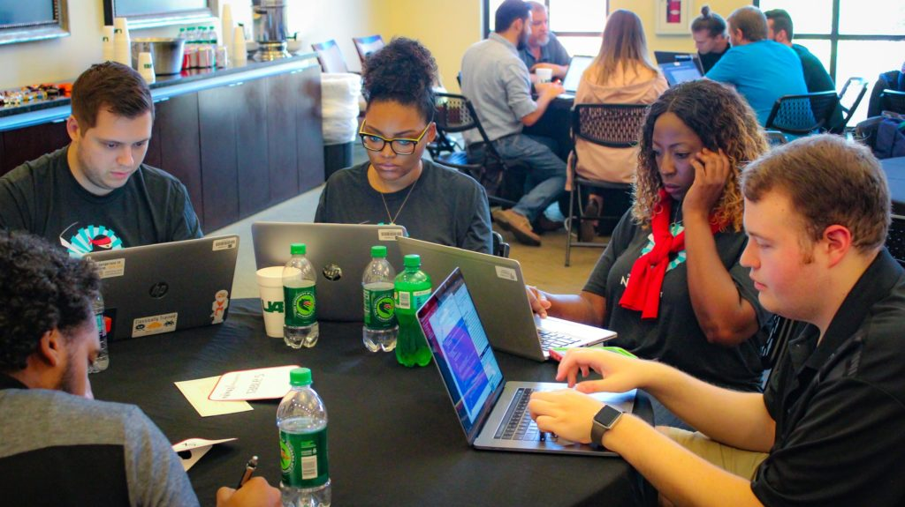

# SIAM FM21 Programming Challenge Sponsored by MathWorks

  
   
  

# Introduction

Welcome to the first SIAM FM Programming Challenge sponsored by MathWorks! The main focus of quantitative and data science roles in the finance industry today is to implement research in a real-world context. Student teams, composed of undergraduate and graduates from any activity areas of SIAM, shall partake in a two month programming challenge to solve a mathematical programming problem arising in financial modeling using MATLAB. Winning teams shall be awarded cash prizes at a FM21 award ceremony which shall take place either virtually or in hybrid mode between June 1st-4th in Philadelphia. Please take note of the important deadlines below and ensure that your team is registered by 11:59pm EST, January 31, 2021. 

# Competition Rules 

Teams shall consist of up to 3 members with a minimum of 2. Teams can be composed of actively enrolled undergraduate and graduate students from all disciplines of applied mathematics, computational science and engineering. We strongly encourage multi-disciplinary teams. By enrolling in the challenge, at least one member of your team must attend the conference if invited. We shall invite the top 4 teams to present. 

The programming challenge has been structured to encourage wide engagement across the student community, providing participant teams the necessary bandwidth to apply various methodologies known across the quant industry and the research community to the same problem. Solutions shall consist of both MATLAB code submissions in addition to a short written report describing the solution. Each team submission shall be scored according the following rubric: up to 40% shall be awarded for performance of the team’s solution on test data, up to 40% shall be awarded for novelty of the solution, and up to 20% shall be awarded for clarity of the solution approach as evidenced by the quality of the report and the submitted code.

MathWorks, makers of MATLAB and Simulink, is offering participating teams complimentary software, tutorials, and videos.
.

# Prizes

The winning team shall receive $400, and teams in second, third, and fourth place shall respectively receive $300, $200, and $100. Each invited team shall be reimbursed for travel expenses by an amount not to exceed $150 per participant. 

# Important Dates 

- 11:00am EST, January 25: Q&A webinar with the SIAM FM21 programming challenge committee (details sent via Slack). 
- 11:59pm EST, January 31: Team registration deadline closes.
- 11:59pm EST, March 31: Submission deadline.
- 5:00pm EST, April 16: Selection of finalist teams. 
- June 1-4: Award Ceremony at SIAM FM21 (date and time TBA).

# Programming Challenge Instructions

The programming challenge shall consist of optimizing a portfolio of stocks by constructing a trading strategy which uses historical stock prices. You shall use the  to generate the stock price history with market impact. The specification of the problem together with the modeling and documentation requirements are provided .  See  for details of how to initialize and update the simulator using an example strategy and examples of how to plot the results. You should replace the example strategy with your own implementation. Note that the values of the market simulator parameters in the run_strategy.m file have been preset by the programming challenge committee but you are free to (and should) change them.

At the end of the competition, each team shall submit their code and report to the programming challenge committee by the March 31 deadline. The team must provide an additional test function, in a file test_strategy.m, which shall take as an argument a market simulator object, use the optimal set of weights (found during training) and return the updated market simulator object as follows:

function simObj = test_strategy(simObj)  
    &nbsp;&nbsp;&nbsp simObj.reset(); % reset simulation environment  
    &nbsp;&nbsp;&nbsp for i=1:simObj.T  
    &nbsp;&nbsp;&nbsp;&nbsp;&nbsp   w = get_strategy_weights(...) % your strategy should return the weights 
    &nbsp;&nbsp;&nbsp;&nbsp;&nbsp   simObj.step(w); 
end 
  
It is important to clarify that the test_strategy function should not perform any optimization. Note also that the program challenge committee shall modify the parameters of the market simulator for testing purposes and run each team’s test function with several new market simulator objects and calculate the utilty function from your returned market simulator object. Each team shall be ranked by their aggregate utility function values across various test cases and assigned up to 40% of the overall competition score. Further details of where to submit your team solution shall be added here later.

# Registration 

Please register your team using this link: https://forms.gle/h8AiKabmdYnjwiux9 . In the unlikely event that the team changes after the registration deadline, please contact the programming challenge committee for approval. Teams that do not register their team by the deadline or change their team members without approval shall be disqualified from the competition.

# Slack Channel Updates

From time to time, the committee shall make announcements and provide additional clarification through Slack. You can subscribe to the channel here: https://join.slack.com/t/siamfm21progr-kcw5581/shared_invite/zt-klgcd2xx-bRg_BeB1blJrscQ567yLXw . You are strongly encouraged to subscribe to the channel, post questions and stay abreadst of the latest updates. You can download the slack app for your smartphone or desktop at no cost. This webpage shall also be periodically updated and you should check the latest version before submitting your solution. 

# Contact Information

The SIAM FM21 Programming Challenge Committee:

- Matthew Dixon, Assistant Professor, Department of Applied Math, Illinois Tech. Email: matthew [dot] dixon [at] iit [dot] edu (Chair)
- Stuart Kozola, Head of Product Management and Strategy - Quantitative Finance, MathWorks. Email: skozola [at] mathworks [dot] com

